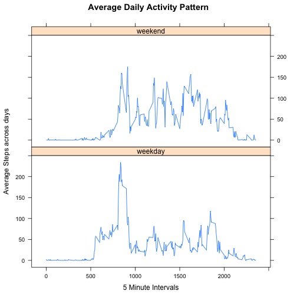

## Loading and preprocessing the data
The data for this assignment was obtained from [Activity monitoring data](https://d396qusza40orc.cloudfront.net/repdata%2Fdata%2Factivity.zip) on Sat Nov 15 23:21:32 2014. To download and unzip the file, I used the following routine called unzipAfterDownload.


```r
  unzipAfterDownload <- function() {
    filePath <- function(...) { paste(..., sep = "/") }
    url <- "https://d396qusza40orc.cloudfront.net/repdata%2Fdata%2Factivity.zip"
      
    zipFile <- "dataset.zip"
    if(!file.exists(zipFile)) { 
      download.file(url, zipFile, method = "curl") 
    }
    unzip(zipFile, exdir = ".") 
  }
```

Once the CSV file was downloaded it was loaded in R datframe using read.csv().

```r
rawData<-read.csv("activity.csv")
```

```
## Warning in file(file, "rt"): cannot open file 'activity.csv': No such file
## or directory
```

```
## Error in file(file, "rt"): cannot open the connection
```

```r
str(rawData)
```

```
## 'data.frame':	17568 obs. of  3 variables:
##  $ steps   : int  NA NA NA NA NA NA NA NA NA NA ...
##  $ date    : Factor w/ 61 levels "2012-10-01","2012-10-02",..: 1 1 1 1 1 1 1 1 1 1 ...
##  $ interval: int  0 5 10 15 20 25 30 35 40 45 ...
```

```r
head(rawData, 5)
```

```
##   steps       date interval
## 1    NA 2012-10-01        0
## 2    NA 2012-10-01        5
## 3    NA 2012-10-01       10
## 4    NA 2012-10-01       15
## 5    NA 2012-10-01       20
```

It can be seen that there are a lot of NA in the steps field. This needs some clean up and will be addressed later. The raw data has steps stored in integer format, date as factor and interval as a coded integer in HHMM format. In ideal scenario we need to modify the date and time format of these variables, but for out analysis we let date and time to take the values as is. To make some basic transformations of variables, it would be useful to have dplyr library loaded. Made the following transformations to plot a histogram of the total number ot steps taken each day.


```r
library(dplyr)
by_date <- group_by(rawData, date)
totalsteps_by_date <- summarise(by_date, sum(steps, na.rm=TRUE))
names(totalsteps_by_date)<-c("date", "steps")
hist(totalsteps_by_date$steps, main="Histogram of Total Number of Steps taken each Day", xlab="Total Steps")
```

 


## What is mean total number of steps taken per day?

To obtain the total number of steps taken per day I grouped the dataset by date and took the total on the number of steps taken for each day.


```r
meanSteps <- mean(totalsteps_by_date$steps)
medianSteps <- median(totalsteps_by_date$steps)
```

The Mean total number of steps taken per day is 9354.2295082  
The Median total number of steps taken per day is 10395  


## What is the average daily activity pattern?  
  
To obtain the total daily activity pattern, I grouped the dataset by interval and took the average on the number of steps taken for each interval. I used type="l" to plot the time series of the average steps taken per interval acrross all days

```r
by_interval <- group_by(rawData, interval)
mean_by_interval <- summarise(by_interval, mean(steps, na.rm=TRUE))
names(mean_by_interval)<-c("interval", "Average_Steps")
plot(mean_by_interval$interval, mean_by_interval$Average_Steps, type="l", xlab="5 Minute Intervals", ylab="Average Steps across days", main="Average Daily Activity Pattern")
```

 


```r
maxIndex<-which.max(mean_by_interval$Average_Steps)
maxAvgInterval <- mean_by_interval[maxIndex,]$interval
```

### Observations from Daily Activity Pattern
1. The interval with the  maximum average steps is 835 
2. This implies, the person runs or walks in the morning around 8:35
3. The person sleeps around 11 PM to 12 AM
4. The Person wakes up at 5:15 AM
5. The Person manages to be relatively active all day long


## Imputing missing values


There were 2304 missing elements in the data set (computation shown below).
To fill in the missing values for the steps, I used the strategy of picking up the mean of the step values corresponding to the intervals from remaining of the data set. To help this I wrote a function getmeanStepsforInterval

```r
getmeanStepsforInterval<- function(x){
    x[["steps"]] <- filter(mean_by_interval, interval == as.integer(x[["interval"]]))$Average_Steps
}
naRows<-is.na(rawData$steps)
beforeFillingNa<-sum(is.na(rawData$steps))
formatData<-read.csv("activity.csv")
```

```
## Warning in file(file, "rt"): cannot open file 'activity.csv': No such file
## or directory
```

```
## Error in file(file, "rt"): cannot open the connection
```

```r
formatData[naRows,]$steps<-apply(rawData[naRows,], 1, function(x) getmeanStepsforInterval(x))
afterFillingNa<-sum(is.na(rawData$steps))
```
Now all NAs in the dataset have been replaced by the average steps over the interval. Number of NA rows in the dataset now is equal to 2304  
  
Plotting the histogram for the new data with NA's removed/replaced, we find interesting observations. 

###Observations after removing NA
1. The number of days with fewer than 5000 steps reduced from 13 to 5
2. Number of days with 10,000 to 15,000 steps increasaed from 28 to 36
3. Most importantly the data got Normalized and the mean was qual to the median.

  This new data thus gives a more accurate insights on the activity pattern.

```r
by_date_fd <- group_by(formatData, date)
totalsteps_by_date_fd <- summarise(by_date_fd, sum(steps, na.rm=TRUE))
names(totalsteps_by_date_fd)<-c("date", "steps")
hist(totalsteps_by_date_fd$steps, main="Histogram of Total Number of Steps Per Day in New Data without NA", xlab="Total Steps")
```

 


```r
meanSteps_fd <- mean(totalsteps_by_date_fd$steps)
medianSteps_fd <- median(totalsteps_by_date_fd$steps)
```

The Mean total number of steps taken per day in the new dataset with no NA is 10766.189.  
The Median total number of steps taken per day in the new dataset with no NA is 10766.189.
We can find the data to be normalized and the mean to be equal to the median.  


## Are there differences in activity patterns between weekdays and weekends?


To find the difference in activity pattern between weekday and weekends, i created a new variable called weekday by using weekday() function.
Later calculated the average steps per interval with weekday as the factor. The code for it is given below.


```r
newDataWithDay<-mutate(rawData, day=weekdays(as.Date(rawData$date)))
wekdayOrWeekend<- function(x){
if(x[["day"]]=="Saturday" || x[["day"]]=="Sunday")
f <- "weekend"
else
f<-"weekday"
f
}
newDataWithWeekday<-mutate(newDataWithDay, weekday_Weekend = apply(newDataWithDay, 1, function(x) wekdayOrWeekend(x)))
newDataWeekday<-filter(newDataWithWeekday, weekday_Weekend == "weekday")
newDataWeekend<-filter(newDataWithWeekday, weekday_Weekend == "weekend")
by_interval_wd <- group_by(newDataWeekday, interval)
mean_by_interval_wd <- summarise(by_interval_wd, mean(steps, na.rm=TRUE))
names(mean_by_interval_wd)<-c("interval", "Average_Steps")
by_interval_we <- group_by(newDataWeekend, interval)
mean_by_interval_we <- summarise(by_interval_we, mean(steps, na.rm=TRUE))
names(mean_by_interval_we)<-c("interval", "Average_Steps")
mean_by_interval_we<-mutate(mean_by_interval_we, Day="weekend")
mean_by_interval_wd<-mutate(mean_by_interval_wd, Day="weekday")
mean_by_interval_bind<-rbind(mean_by_interval_we, mean_by_interval_wd)
mean_by_interval_bind$Day <- as.factor(mean_by_interval_bind$Day)
```

  
To plot the data I used lattice plot and factored the plot on the variable weekday as follows. 

```r
library(lattice)
xyplot(Average_Steps ~ interval | Day, type="l", xlab="5 Minute Intervals", ylab="Average Steps across days", main="Average Daily Activity Pattern", data = mean_by_interval_bind, layout = c(1, 2))
```

 

### Observations from Weekday Vs Weekend
1. The Person wakes up at 5:15 AM on the weekdays and around 7:30 on weekends.
2. The person is more active on weekends than weekdays. This might imply that he works in a job, where he does not get to move a lot.
3. Both weekdays and weekends, he has relatively more activity in the morning, which means he likes to workout in the morning.


